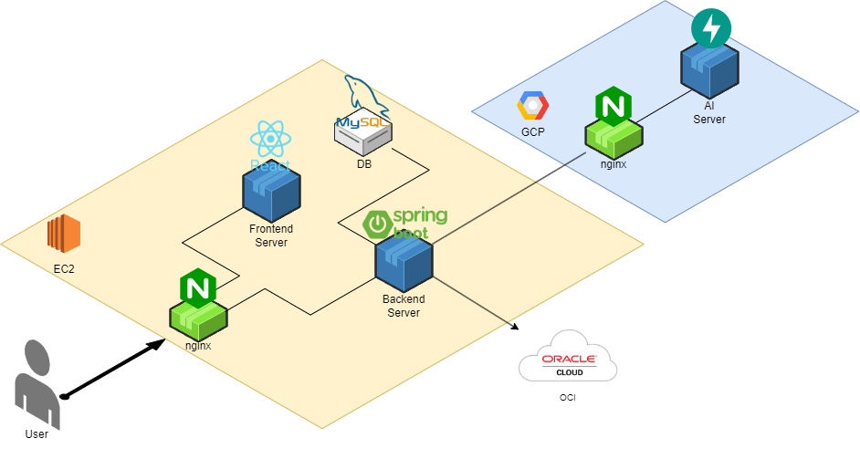

# SSAFY 10기 & DA사업부 전자 연계 프로젝트 - Familiar
👑 **삼성 청년 SW 아카데미 10기 & 삼성전자 DA사업부 연계 프로젝트 1등 수상**👑

<!--프로젝트 대문 이미지-->
<a href="https://www.youtube.com/watch?v=DGH4enc_nlA"></a>

<small>_해당 이미지를 클릭하면 티저영상으로 이동됩니다._</small>

<!--목차-->
# 🎈 Table of Contents
- [[1] 프로젝트 소개](#1-프로젝트-소개)
  - [Features](#features)
  - [Technologies](#technologies)
- [[2] 포팅 메뉴얼](#2-포팅-메뉴얼)
  - [Prerequisites](#prerequisites)
  - [Installation](#installation)
  - [Configuration](#configuration)
- [[3] 상세 기능 소개](#3-상세-기능-소개)
- [[4] 팀 소개](#4-팀-소개)
- [[5] 레퍼런스](#5-레퍼런스)


# 1️⃣ 프로젝트 소개

이미지 생성형 AI을 활용한 삼성 비스포크 패밀리허브 가족 소통 서비스

32인치 디스플레이를 활용하여 **소통의 매개체**로서 가족의 행복을 책임지는 비스포크 패밀리허브


## Features

- **가족들 간 하루 일상 공유 기능**
  - 음성 인식을 통해 냉장고에서도 손쉬운 입력
  - 인물 모델로 화자의 얼굴이 들어가도록 하여 사진을 찍지않아도 개인화된 이미지 생성
  - **하루 공유, 질문과 답변** 두 가지 방법으로 소통 가능

- **Dream Painter**
  - 화이트보드에 그린 낙서를 AI를 통해 퀄리티 높은 작품으로 완성
  - 부모가 주방에 있는 동안에도 아이와 부모를 연결
  - 비스포크 패밀리허브에 탑재된 미러링 기능을 통해 태블릿, 스마트폰 등 어떤 기기를 통해 그려도 주방에서 확인 가능


## Technologies
***언어, 프레임워크, 주요 라이브러리**를 **버전**과 함께 나열하세요.*

### Version Info
**FRONTEND**
- [React]

**BACKEND**
- [Java](https://www.java.com/ko/) 17
- [Gradle](https://gradle.org/) 8.6
- [MySQL](https://www.mysql.com/) 8.0
- [Spring](https://spring.io/) 3.2.3

**AI**
- [CUDA](https://developer.nvidia.com/cuda-toolkit) 11.8.0
- [cuDNN](https://developer.nvidia.com/cudnn) 9.0.0
- [Python](https://www.python.org/) 3.10.6
- [PyTorch](https://pytorch.org/) 2.2.1

## Architecture


# 2️⃣ 포팅 메뉴얼
*만약 운영체제에 따라 프로그램을 다르게 동작시켜야한다면, 운영체제별로 동작 방법을 설명하세요*

## Prerequisites
*프로젝트를 동작시키기 위해 필요한 소프트웨어와 라이브러리를 나열하고 어떻게 다운받을 수 있는지 설명하세요.*

- [OpenWeather API key](https://openweathermap.org/) (무료)
- npm
```bash
npm install npm@latest -g
```

## Installation
*어떻게 이 프로젝트의 소스코드를 다운받을 수 있는지 설명하세요.*
1. Repository 클론
```bash
git clone https://github.com/your-username/project-repository
```
2. NPM packages 설치
```bash
npm install
```

## Configuration
*코드의 어느 부분을 채우거나 수정해야하는지 설명하세요.*
- `config.js`에 Openweather API key를 입력
```bash
const API_KEY = "<Your API key>";
```


# 3️⃣ 상세 기능 소개
***스크린샷, 코드** 등을 통해 **사용 방법**과 **사용 예제**를 보여주세요. 사용 예제별로 h2 헤더로 나누어 설명할 수 있습니다.*


```java
// 몇 개의 API 사용 예제를 코드와 함께 보여주세요.
```


# 4️⃣ 팀 소개

**SSAFY + AI + DA = 🥤SSAIDA 팀**
<center>
<table>
    <tr height="160px">
        <td align="center" width="200px">
            <a href="https://github.com/yeaaaaahhhhh"></a>
            <br />
            <a href="https://github.com/yeaaaaahhhhh">김예현</a>
        </td>
        <td align="center" width="200px">
            <a href="https://github.com/KINHYEONJI"></a>
            <br />
            <a href="https://github.com/KINHYEONJI">김현지</a>
        </td>
        <td align="center" width="200px">
            <a href="https://github.com/Jaeseon95"></a>
            <br />
            <a href="https://github.com/Jaeseon95">박재선</a>
        </td>
    </tr>
    <tr height="30px">
        <td align="center">
            Back-End
            <br />
        </td>
        <td align="center">
            Front-End    
        </td>
        <td align="center">
            AI Modeling
        <br>
        </td>
    </tr>
    <tr height="160px">
        <td align="center" width="200px">
            <a href="https://github.com/fangdol888"></a>
            <br />
            <a href="https://github.com/fangdol888">백승윤</a>
        </td>
        <td align="center" width="200px">
            <a href="https://github.com/dokuny"></a>
            <br />
            <a href="https://github.com/dokuny">이도훈</a>
        </td>
        <td align="center" width="200px">
            <a href="https://github.com/sejinnnnnn"></a>
            <br />
            <a href="https://github.com/sejinnnnnn">천세진</a>
        </td>
    </tr>
    <tr height="30px">
        <td align="center">
            CI/CD
            <br />
            Model Serving
        </td>
        <td align="center">
            Back-End
            <br />
            Prompt Engineering
        </td>
        <td align="center">
            CI/CD
           <br />
            Prompt Engineering
        </td>
    </tr>
<table>
</center>

# [5] 레퍼런스
[Huggingface - diffusers](https://huggingface.co/docs/diffusers/index)  
[DreamBooth: Fine Tuning Text-to-Image Diffusion Models for Subject-Driven Generation](https://dreambooth.github.io/)  
[LoRA: Low-Rank Adaptation of Large Language Models](https://github.com/microsoft/LoRA)  
[clip-interrogator](https://github.com/pharmapsychotic/clip-interrogator)


<!--URLS-->
[license-url]: LICENSE.md
[contribution-url]: CONTRIBUTION.md
[readme-eng-url]: ../README.md
