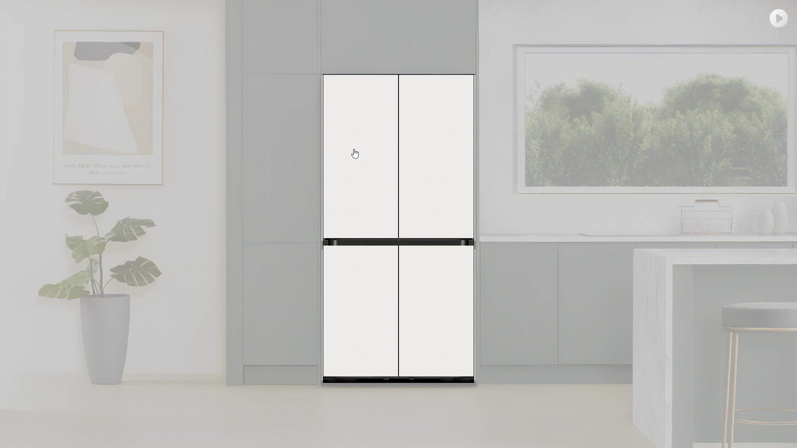

# SSAFY 10기 & DA사업부 전자 연계 프로젝트 - Familiar

<!--프로젝트 대문 이미지-->

<!--  -->

<small>_해당 이미지를 클릭하면 티저영상으로 이동됩니다._</small>

>👑 **삼성 청년 SW 아카데미 10기 & 삼성전자 DA사업부 연계 프로젝트 1등 수상**👑
<!--목차-->
# 🎈 Table of Contents
- [1️⃣ 프로젝트 소개](#1️⃣-프로젝트-소개)
  - [Features](#features)
  - [Technologies](#technologies)
  - [Architecture](#architecture)
- [2️⃣ 상세 기능 소개](#2️⃣-상세-기능-소개)
- [3️⃣ 팀 소개](#3️⃣-팀-소개)
- [4️⃣ 레퍼런스](#4️⃣-레퍼런스)

 

# 1️⃣ 프로젝트 소개

> 이미지 생성형 AI을 활용한 삼성 비스포크 패밀리허브 가족 소통 서비스

“부엌은 조리와 식사만을 위한 공간이 아닌 가족의 소통, 취미를 위한 공간으로 확장된다.”  
해당 문구는 삼성 칼럼 ‘일상을 확장시키는 비스포크 패밀리허브 플러스‘ 에서 발췌해 온 문구인데요,  
저희 팀은 가전을 소통의 매개체로 하여 가족을 더 행복하게 만들어준다는 삼성전자의 인사이트에 깊이 공감하였습니다.
  

그렇다면 여러분들은 하루에 얼마나 가족들과 소통하시나요?
  

많은 사람들이 행복한 가정의 필수 조건으로 가족간의 대화와 관심을 중요한 가치로 생각하는 것에 비해,
하루 평균 대화 시간은 30분 미만인 가정이 70%에 달했습니다.  
이처럼 가족간의 소통은 매우 중요하나, 실제로 소통이 활발하게 이루어지는 것은 쉽지 않습니다.
  

왜 가족 간의 소통이 활발하지 않은걸까요?  
여러 이유가 있겠지만, 저희는 바쁜 현대 사회 속 소통의 시간이 부족한 게 가장 큰 이유라고 생각하였습니다.
  

따라서, 저희가 추구하는 소통 방식은 Life and Vivid 커뮤니케이션 입니다.
  

첫째, 일상 속에서 자연스럽고 간편하게 소통하는 것  
둘째, 간편하게 소통하는 만큼 시각적인 매체를 통해서 더욱 선명하고 생생한 기억을 남겨주는 것
  

그렇다면 어떻게 삶에 녹아들어 선명하게 소통할 수 있을까요?  
고민한 결과, 저희는 비스포크 패밀리허브 냉장고를 떠올리게 되었는데요,
  

아무리 바쁜 하루를 보내더라도 모든 가족들이 하루에 적어도 한번은 냉장고 앞에 마주서게 되는데요,  
모두가 마주하는  가전인 냉장고의 특성과 32인치 디스플레이를 가진 비스포크 패밀리허브의 특성을 결합한다면  
비스포크 패밀리허브에서 사용자들이 자연스럽고 가시적인 소통을 할 수 있을 것이라 생각했습니다.
  

그럼 비스포크 패밀리허브에서 무엇을 하며 소통을 극대화 할 수 있다는 것일까요?
  

먼저 자신의 하루를 쉽게 공유하며 소통을 할 수 있습니다.  
집에 들어와 냉장고 앞에서 간단하게 음성으로 하루를 공유할 수도 있고, 평소 궁금했던 것들에 질문을 남기고 답변을 확인하며 소통을 시작할 수 있습니다.  
음성과 텍스트 뿐만 아니라 그림을 통해서도 소통을 할 수 있도록 하였는데요,  
상상력을 자극하는 재미있는 컨텐츠들로 대화의 주제를 선택해 대화를 시작할 수 있습니다.
  

소통을 극대화 하는 기능을 모두 담은 저희의 서비스,  
가족들의 일상까지 싱싱하게 보관하다, Familiar를 소개합니다.  

## Features

- **가족들 간 하루 일상 공유 기능**
  - 음성 인식을 통해 냉장고에서도 손쉬운 입력
  - 인물 모델로 화자의 얼굴이 들어가도록 하여 사진을 찍지않아도 개인화된 이미지 생성
  - **하루 공유, 질문과 답변** 두 가지 방법으로 소통 가능

- **Dream Painter**
  - 화이트보드에 그린 낙서를 AI를 통해 퀄리티 높은 작품으로 완성
  - 부모가 주방에 있는 동안에도 아이와 부모를 연결
  - 비스포크 패밀리허브에 탑재된 미러링 기능을 통해 태블릿, 스마트폰 등 어떤 기기를 통해 그려도 주방에서 확인 가능

## Technologies
### Version Info
**FRONTEND**
- [React]

**BACKEND**
- [Java](https://www.java.com/ko/) 17
- [Gradle](https://gradle.org/) 8.6
- [MySQL](https://www.mysql.com/) 8.0
- [Spring](https://spring.io/) 3.2.3

**AI**
- [CUDA](https://developer.nvidia.com/cuda-toolkit) 11.8.0
- [cuDNN](https://developer.nvidia.com/cudnn) 9.0.0
- [Python](https://www.python.org/) 3.10.6
- [PyTorch](https://pytorch.org/) 2.2.1

## Architecture

 

# 2️⃣ 상세 기능 소개
### 비스포크 패밀리허브 색상에 따른 배경 변경

<small>색상을 선택할 수 있는 비스포크 패밀리허브의 특성에 맞춰 서비스의 배경색이 변경됩니다.</small>

### 가족 간 하루 일상 공유 & 질문 

<small>
음성을 통해 하루 일상이나 질문을 남기면, 가족의 얼굴을 학습한 Stable Diffusio 모델 기반으로 생성된 이미지가 생성되고 이를 통해 시간에 제약받지 않으며 가족과 소통할 수 있습니다.
</small>

### Dream Painter

<small>그림을 그리고 화풍을 선택하면 화풍에 따른 LoRA를 이용하여 그림을 더 좋은 퀄리티로 바꾸어줍니다.
</small>

 

# 3️⃣ 팀 소개

**SSAFY + AI + DA = 🥤SSAIDA 팀**
<!-- 

<table>
    <tr height="160px">
        <td align="center" width="200px">
            
             
            <a href="https://github.com/yeaaaaahhhhh">김예현</a>
        </td>
        <td align="center" width="200px">
            
             
            <a href="https://github.com/KINHYEONJI">김현지</a>
        </td>
        <td align="center" width="200px">
            
             
            <a href="https://github.com/Jaeseon95">박재선</a>
        </td>
    </tr>
    <tr height="30px">
        <td align="center">
            Back-End
             
        </td>
        <td align="center">
            Front-End    
        </td>
        <td align="center">
            AI Modeling
         
        </td>
    </tr>
    <tr height="160px">
        <td align="center" width="200px">
            
             
            <a href="https://github.com/fangdol888">백승윤</a>
        </td>
        <td align="center" width="200px">
            
             
            <a href="https://github.com/dokuny">이도훈</a>
        </td>
        <td align="center" width="200px">
            
             
            <a href="https://github.com/sejinnnnnn">천세진</a>
        </td>
    </tr>
    <tr height="30px">
        <td align="center">
            CI/CD
             
            Model Serving
        </td>
        <td align="center">
            Back-End
             
            Prompt Engineering
        </td>
        <td align="center">
            CI/CD
            
            Prompt Engineering
        </td>
    </tr>
<table>

 -->

|  |  |  |
|:---:|:---:|:---:|
| [김예현](https://github.com/yeaaaaahhhhh) | [김현지](https://github.com/KINHYEONJI) | [박재선](https://github.com/Jaeseon95) |
| Back-End | Front-End | AI Modeling |

|  |  |  |
|:---:|:---:|:---:|
| [백승윤](https://github.com/fangdol888) | [이도훈](https://github.com/dokuny) | [천세진](https://github.com/sejinnnnnn) |
| CI/CD Model Serving | Back-End Prompt Engineering | CI/CD Prompt Engineering |

 

# 4️⃣ 레퍼런스
[Huggingface - diffusers](https://huggingface.co/docs/diffusers/index)  
[DreamBooth: Fine Tuning Text-to-Image Diffusion Models for Subject-Driven Generation](https://dreambooth.github.io/)  
[LoRA: Low-Rank Adaptation of Large Language Models](https://github.com/microsoft/LoRA)  
[clip-interrogator](https://github.com/pharmapsychotic/clip-interrogator)

<!--URLS-->
[license-url]: LICENSE.md
[contribution-url]: CONTRIBUTION.md
[readme-eng-url]: ../README.md
